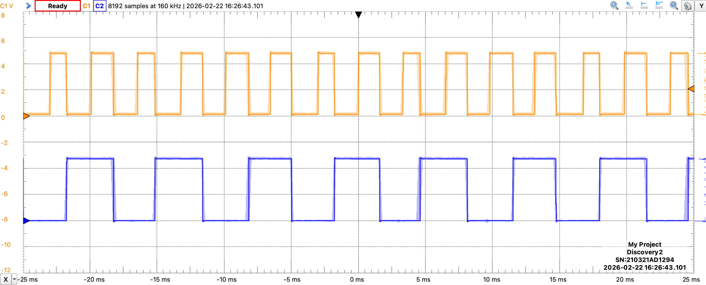
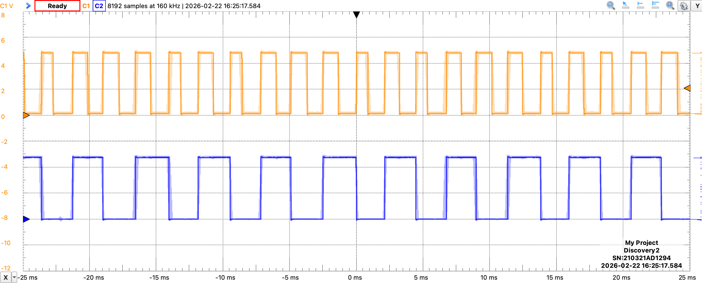

# Lab 1: Supplemental Worksheet: Romi Encoders

This is an individual assignment, but you may discuss the material with others, so long as the work you submit is your own.

> 1. The `Romi32U4EncodedMotor` template class does not use the more familiar `analogWrite()` to command the motors. How does it set the duty cycle for the motor PWM signal?

> 2. Referencing the previous question, what value of effort sets the duty cycle to 100%? (This value may be different that what you used in RBE 2001.)

> 3. What is the frequency of the motor PWM signal? How did you determine the value? (Note: The actual frequency in our libraries is different from the original Pololu libraries, but it's not far off.)

> 4. In the table below, identify all of the pins (using the Arduino pin convention) that could be used to register interrupts from an external source. Include both external interrupt pins and pins with pin change interrupts. For each pin, identify any conflicts with existing functionality of the Romi. The first one has been done for you. Add lines, as needed.

| Interrupt | Arduino pin | Conflict |
|:--:|:--:|:--:|
| PCINT0 | 17 | Button C, LCD |
.
.
.

> The following table is used for the next two questions.

|XOR|newB|newA|lastB|lastA|lastA^newB|newA^lastB|∆encCount|
|:--:|:--:|:--:|:--:|:--:|:--:|:--:|:--:|
|$\uparrow$|1| | | | | | |
|$\uparrow$|0| | | | | | |
|$\downarrow$|1| | | | | | |
|$\downarrow$|0| | | | | | |
| | | | | | | | |
|$\uparrow$|1| | | | | | |
|$\uparrow$|0| | | | | | |
|$\downarrow$|1| | | | | | |
|$\downarrow$|0| | | | | | |

> 5. Consider the encoder capture in the figure below. Referring to `ProcessEncoderTick()` (found in `Romi32U4MotorTemplate.h`), complete the *first four lines* in the table above to determine if the transitions on `XOR` result in incrementing or decrementing `encCount`. The first column corresponds to transition of the XOR pin. The second column refers to the state of the Channel B pin *immediately after* the transition (i.e., as read in the ISR). Use 0 and 1 instead of L and H for consistency. The remaining column names refer to the variables in `ProcessEncoderTick()`, and *can be inferred from the given information*.

> 6. Repeat the process for the last four line of the table, using the opposite motion in the figure below. Note that the first two columns are repeated, but the other variables can be used to differentiate the motion.

> 7. Which figure corresponds to forward motion (defined as incrementing `encCount`)?

> 8. With all the extra processing needed, why does Pololu use an XOR gate in their encoder circuit?

> 9. Describe in your own words why an integral term is needed for speed control. Why don’t we just make $K_P$ really big?

> 10. What are two potential negative consequences of adding integral control?