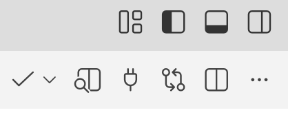

# Lab 1: Group Worksheet: Speed Control

This is a group activity. Submit one worksheet per group on Canvas.

> 1. Describe your motor speed control algorithm. What values did you use for gains? Include a snapshot of the motor response to a step change in target speed for *each* Romi. Annotate each figure to show the rise time (defined here as the time from 10% $\rightarrow$ 90% of the target), overshoot (if present), and the settling time (let $\delta$ be 2% of the target). Estimate their values as best you can. Note that you can easily change the time scale in Teleplot to get decent graphs.

Recall how to add a figure


> 2. Paste the contents of one version of `ControlMotorSpeed()` here (you may remove the lines that just print values to save space). Consulting the functional architecture diagram from class, which function does `ControlMotorSpeed()` implement?

```
Use a code block.
```

> 3. Paste the contents of one version of `SetWheelSpeeds()` here. Consulting the functional architecture diagram from class, which function does `SetWheelSpeeds()` implement?

Etc.

> 4. Paste the contents of `SetTwist()` here. Consulting the functional architecture diagram from class, which function does `SetTwist()` implement?

> 5. Add a *clickable* link to a [GitHub release](https://docs.github.com/en/repositories/releasing-projects-on-github/managing-releases-in-a-repository) of each person's repository. Tag the releases as `lab01-speed-controller`. Use the same for the release title. A significant portion of your grade will focus on your code, both functionality and style. Be sure to follow proper practices and put comments in your code that describe what it does.
